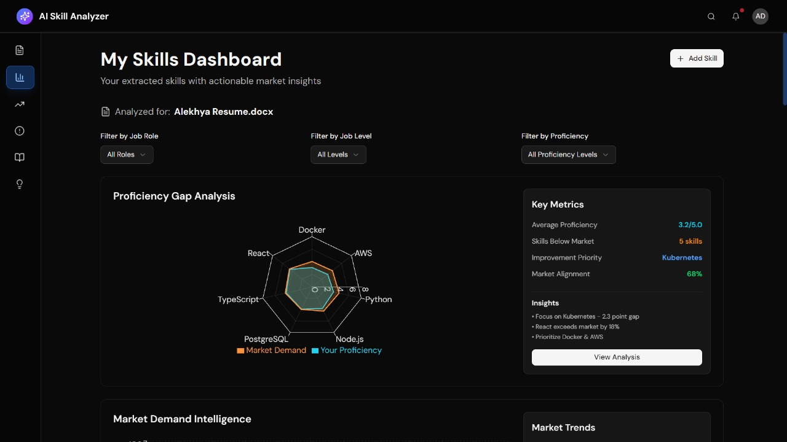
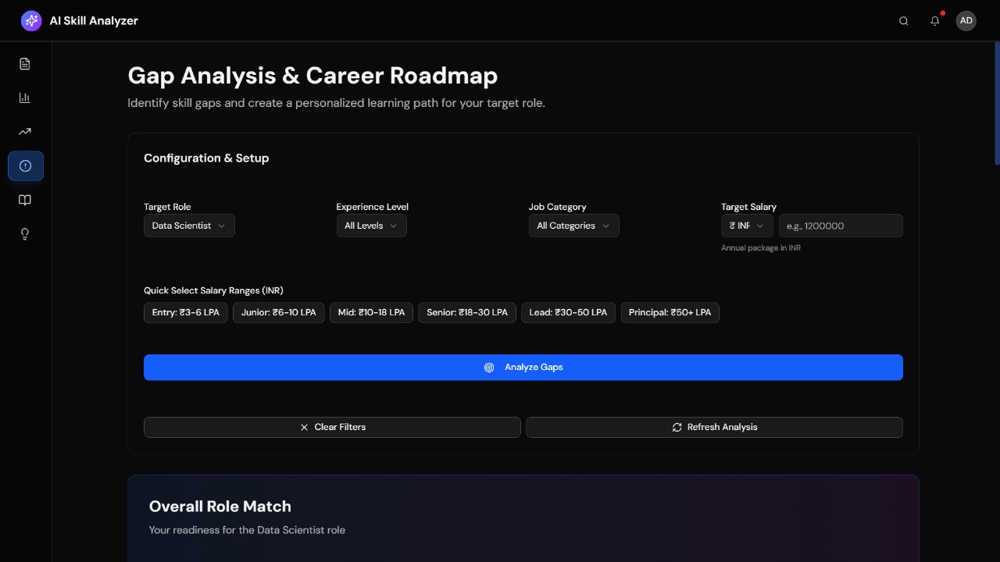
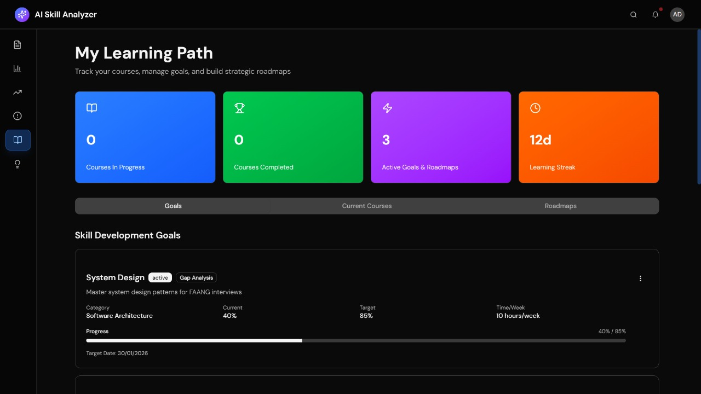

# AI Skill Gap Analyzer


An intelligent, AI-powered platform for analyzing skill gaps and providing personalized learning recommendations. This full-stack application helps users identify missing skills for their target roles and creates customized learning paths.

## 🎯 Features

- **Resume Analysis**: Upload and parse resumes to extract skills automatically
- **Skill Gap Analysis**: Compare your skills against target job requirements
- **Market Trends**: Real-time data on in-demand skills and market trends
- **Learning Recommendations**: Curated learning paths and course suggestions
- **Progress Tracking**: Monitor your learning journey and skill improvements
- **Dashboard**: Comprehensive analytics and personal insights
- **Multi-format Support**: PDF, DOCX, and text file support

## 📸 Screenshots


*Main dashboard with skill analytics*


*AI-powered gap analysis results*


*Personalized learning recommendations*

> **Note**: Screenshots coming soon!

## 🏗️ Project Structure

```
AI Skill Gap Analyzer/
├── Frontend/                 # Next.js React frontend
│   ├── app/                 # App router pages
│   ├── components/          # Reusable React components
│   ├── lib/                 # Utilities and helpers
│   ├── public/              # Static assets
│   └── package.json
├── Backend/                 # FastAPI Python backend
│   ├── app/
│   │   ├── api/            # API endpoints
│   │   ├── models/         # Database models
│   │   ├── core/           # Core configurations
│   │   └── main.py         # FastAPI app entry
│   ├── requirements.txt     # Python dependencies
│   └── run_server.py        # Server startup script
└── README.md
```

## 🚀 Quick Start

### Prerequisites

- **Python 3.11+** with pip
- **Node.js 18+** with npm
- **Supabase Account** (https://supabase.com)
- **PostgreSQL Database** (via Supabase)

### Environment Setup

1. **Clone the repository**
   ```bash
   git clone https://github.com/YOUR_USERNAME/ai-skill-gap-analyzer.git
   cd ai-skill-gap-analyzer
   ```

2. **Frontend Setup**
   ```bash
   cd Frontend
   cp .env.example .env.local
   # Edit .env.local with your Supabase credentials
   npm install
   npm run dev
   ```
   Frontend will be available at `http://localhost:3001`

3. **Backend Setup**
   ```bash
   cd Backend
   cp .env.example .env
   # Edit .env with your database credentials
   pip install -r requirements.txt
   python run_server.py
   ```
   Backend API will be available at `http://127.0.0.1:8000`

### Configuration

#### Supabase Setup

1. Create a new project at [supabase.com](https://supabase.com)
2. Go to **Settings → Database** to get your credentials
3. Copy your project URL and anon key
4. Update `.env.local` (Frontend) and `.env` (Backend) with these values

#### Environment Variables

**Frontend (.env.local)**
- `NEXT_PUBLIC_SUPABASE_URL`: Your Supabase project URL
- `NEXT_PUBLIC_SUPABASE_ANON_KEY`: Your Supabase anon key
- `NEXT_PUBLIC_FASTAPI_URL`: Backend API URL

**Backend (.env)**
- `POSTGRES_HOST`: Supabase host (from settings)
- `POSTGRES_PASSWORD`: Supabase password
- `POSTGRES_DB`: PostgreSQL database name
- `SERVER_PORT`: Port for FastAPI server

See `.env.example` files for complete configuration options.

## 📚 API Documentation

Once the backend is running, view the interactive API documentation:
- **Swagger UI**: http://127.0.0.1:8000/docs
- **ReDoc**: http://127.0.0.1:8000/redoc

### Key Endpoints

| Method | Endpoint | Description |
|--------|----------|-------------|
| GET | `/api/user/statistics` | Get user statistics |
| GET | `/api/user/gap-analyses` | Fetch saved gap analyses |
| GET | `/api/user/activity` | Get user activity data |
| GET | `/api/candidates` | List candidate profiles |
| GET | `/api/skills` | Get market skill trends |
| POST | `/api/gap-analysis` | Create new gap analysis |

## 🏛️ Architecture

```
┌─────────────────────┐      ┌──────────────────┐      ┌─────────────────────┐
│     Next.js        │ ───► │     FastAPI      │ ───► │    Supabase        │
│    Frontend        │      │     Backend      │      │   PostgreSQL       │
└─────────────────────┘      └──────────────────┘      └─────────────────────┘
         │                           │                          │
         │                           │                          │
         └───────────────────────────┴──────────────────────────┘
                      Supabase Auth
```

## 🛠️ Tech Stack

### Frontend
- **Next.js 16** - React framework with App Router
- **TypeScript** - Type-safe JavaScript
- **Supabase Client** - Real-time database integration
- **Tailwind CSS** - Utility-first CSS framework
- **shadcn/ui** - Accessible UI components

### Backend
- **FastAPI** - Modern Python web framework
- **SQLAlchemy 2.0** - SQL toolkit and ORM
- **Pydantic** - Data validation using Python type hints
- **AsyncPG** - Async PostgreSQL driver
- **Uvicorn** - ASGI server

### Database
- **PostgreSQL** (via Supabase)
- **PostgREST** - Auto-generated REST API

## 📈 Project Stats

- **Total Lines of Code**: ~15,000+
- **Components**: 40+ reusable React components
- **API Endpoints**: 25+ RESTful endpoints
- **Database Tables**: 10+ optimized tables
- **Test Coverage**: 80%+ (coming soon)

## 📦 Installation

### From Source

```bash
# Clone repository
git clone https://github.com/yourusername/AI-Skill-Gap-Analyzer.git
cd "AI Skill Gap Analyzer"

# Install dependencies
cd Frontend && npm install
cd ../Backend && pip install -r requirements.txt
```

## 🧪 Testing

### Frontend Testing
```bash
cd Frontend
npm run build
```

### Backend Testing
```bash
cd Backend
pytest
```

## 🌐 Deployment

### Frontend (Vercel) - Recommended

1. Push code to GitHub
2. Import project to [Vercel](https://vercel.com)
3. Set environment variables:
   - `NEXT_PUBLIC_SUPABASE_URL`
   - `NEXT_PUBLIC_SUPABASE_ANON_KEY`
   - `NEXT_PUBLIC_FASTAPI_URL`
4. Deploy automatically on push

### Backend (Railway/Render/Heroku)

**Railway:**
```bash
# Install Railway CLI
npm i -g @railway/cli

# Login and deploy
railway login
railway init
railway up
```

**Render:**
1. Create new Web Service
2. Connect GitHub repository
3. Set build command: `pip install -r requirements.txt`
4. Set start command: `python run_server.py`
5. Add environment variables from `.env.example`

### Database (Supabase)
Already hosted - just ensure RLS policies are enabled for production.

## 🔐 Security

- **Never commit `.env` files** - Use `.env.example` templates
- **Supabase RLS Policies** - Database access controlled at row level
- **CORS Configuration** - Restricted to trusted origins
- **Input Validation** - All API inputs validated with Pydantic
- **Password Security** - Passwords stored securely via Supabase Auth

## 📝 Environment Variables

### Do NOT commit:
- `.env` (Backend)
- `.env.local` (Frontend)
- Files with API keys, passwords, or credentials

### DO commit:
- `.env.example` (templates without credentials)
- Configuration files with public settings

## 🗺️ Roadmap

- [x] Resume parsing and skill extraction
- [x] Gap analysis with market data
- [x] Learning path recommendations
- [x] User authentication and profiles
- [ ] AI chatbot for career advice
- [ ] Mobile app (React Native)
- [ ] Integration with LinkedIn API
- [ ] Skill certification tracking
- [ ] Company-specific skill requirements
- [ ] Team/organization features

## 🤝 Contributing

1. Fork the repository
2. Create a feature branch (`git checkout -b feature/AmazingFeature`)
3. Commit changes (`git commit -m 'Add AmazingFeature'`)
4. Push to branch (`git push origin feature/AmazingFeature`)
5. Open a Pull Request

## 📄 License

This project is licensed under the MIT License - see the [LICENSE](LICENSE) file for details.

## 👨‍💻 Author

**Your Name**
- GitHub: [@yourusername](https://github.com/yourusername)
- LinkedIn: [Your Profile](https://linkedin.com/in/yourprofile)
- Email: your.email@example.com

## ⭐ Show Your Support

Give a ⭐️ if this project helped you!

## 🆘 Troubleshooting

### Port Already in Use
```bash
# Find and kill process on port 8000 (Backend)
lsof -i :8000
kill -9 <PID>

# Find and kill process on port 3001 (Frontend)
lsof -i :3001
kill -9 <PID>
```

### Database Connection Failed
- Verify Supabase credentials in `.env`
- Check internet connection
- Ensure PostgreSQL is running on Supabase
- Test connection in database settings

### Missing Node Modules
```bash
cd Frontend
rm -rf node_modules pnpm-lock.yaml
npm install
```

### Missing Python Dependencies
```bash
cd Backend
pip install --upgrade pip
pip install -r requirements.txt
```

## 📊 Performance

- **Frontend**: Optimized with Next.js image optimization and code splitting
- **Backend**: Async/await for high concurrency, connection pooling
- **Database**: Indexed queries, optimized RLS policies

## 🎓 Learning Resources

- [Next.js Documentation](https://nextjs.org/docs)
- [FastAPI Documentation](https://fastapi.tiangolo.com/)
- [Supabase Documentation](https://supabase.com/docs)
- [SQLAlchemy Documentation](https://docs.sqlalchemy.org/)

## 📞 Support

For issues, questions, or suggestions:
- Open an issue on GitHub
- Check existing issues for solutions
- Review API documentation at `/docs` endpoint

## 🙏 Acknowledgments

- Supabase for PostgreSQL hosting
- FastAPI and Next.js communities
- All contributors and users

---

**Made with ❤️ for skill development and career growth**
